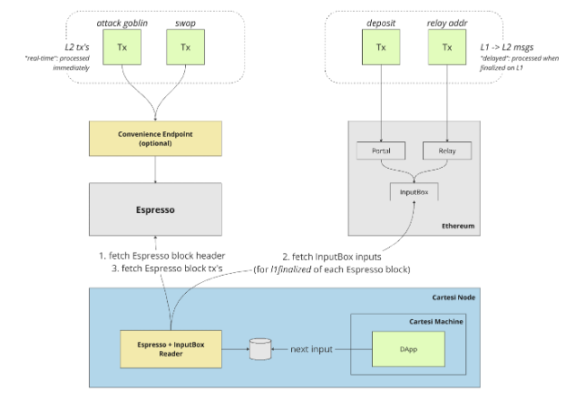
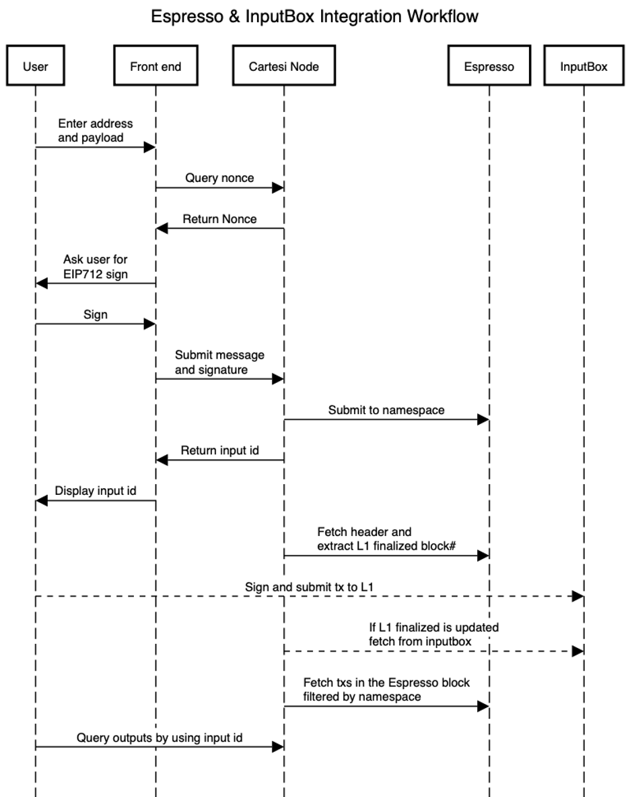

# Architecture

The Cartesi+Espresso integration is based on the concept that inputs to Cartesi DApps are of two fundamentally different natures:

- L2 transactions: these refer to common interactions of users with the application, and refer to application-specific actions such as “attack goblin”, “swap token”, “post message”, etc.; these transactions do not require any direct information or logic from the base layer;

- L1->L2 messages: these refer to information that is relayed from the base layer to the rollup application, such as informing about deposits done via the Portals, relaying the DApp’s address, ensuring base layer validation for a given input, etc.

This architecture proposes that L2 transactions are to be processed “immediately” (i.e., as soon as they are sequenced), whereas L1->L2 messages are only processed when they are finalized on L1, meaning that they are processed “with a delay”.

Aside from that, from the application’s point of view, few things change:

- Back-end: both L2 transactions and L1->L2 messages are received as regular inputs;
- Front-end: L2 transactions are signed by the client and submitted to an L2 submission endpoint on the node, which will then forward them to Espresso; L1->L2 messages are submitted exactly in the same way as current regular Cartesi Rollups inputs (i.e., as a transaction that eventually calls the InputBox contract’s addInput method).

